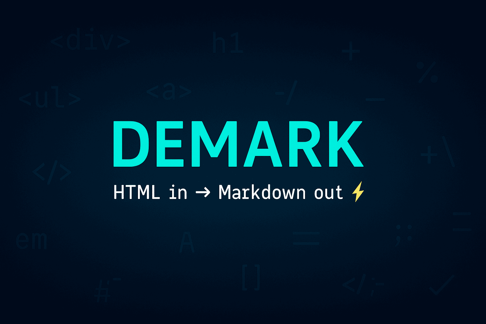

# Demark 🧽 — Scrub HTML down to Markdown

[](https://github.com/steipete/Demark/actions/workflows/ci.yml)
[](https://github.com/steipete/Demark/releases/latest)
[](https://swift.org)
[](Package.swift)
[](LICENSE)



Demark is a Swift package for converting HTML strings and rendered web pages to Markdown on Apple platforms. It uses Turndown.js in a `WKWebView` by default and includes an `html-to-md` engine backed by JavaScriptCore for simpler input.

## Install

In Xcode, choose **File → Add Package Dependencies** and enter:

```text
https://github.com/steipete/Demark.git
```

For a `Package.swift` manifest, add the package and product dependency:

```swift
dependencies: [
    .package(url: "https://github.com/steipete/Demark.git", from: "1.1.0"),
]

.target(
    name: "YourTarget",
    dependencies: [.product(name: "Demark", package: "Demark")]
)
```

Demark requires Swift 6 and has no external Swift Package dependencies.

## Quick start

Call Demark from an async main-actor context:

```swift
import Demark

@MainActor
func convert(_ html: String) async throws -> String {
    try await Demark().convertToMarkdown(html)
}

print(try await convert("<h1>Hello</h1><p>This is <strong>bold</strong>.</p>"))
```

Output:

```markdown
# Hello

This is **bold**.
```

## Choose an engine

Demark exposes two bundled conversion engines:

| Engine | Runtime | Use it for |
|---|---|---|
| `.turndown` (default) | WebKit and a browser DOM | Complex or malformed HTML and configurable heading/code styles |
| `.htmlToMd` | JavaScriptCore on an internal serial queue | Simple, well-formed HTML without a web view |

The public `Demark` API is main-actor isolated. If Turndown cannot complete a conversion, the default path retries the input with `html-to-md`. Both engines support custom bullet markers, skipped tags, and ignored tags; some formatting options are engine-specific.

See [Using Demark](docs/usage.md) for the complete option table, engine behavior, and error model.

## Convert a web page

Demark can load an HTTP or HTTPS URL in an ephemeral `WKWebView`, wait for the rendered document, and convert either the whole page or a selected element:

```swift
import Demark
import Foundation

@MainActor
func convertArticle(at url: URL) async throws -> String {
    try await Demark().convertToMarkdown(
        url: url,
        loadingOptions: URLLoadingOptions(contentSelector: "article")
    )
}
```

URL conversion is not yet in a tagged release — until the next release, depend on `branch: "main"` to use it. It requires WebKit and network access. Loading options cover timeouts, an additional idle delay, CSS selection, and a custom user agent; [the usage guide](docs/usage.md#web-pages) has the details.

## Platform support

The package manifest declares these deployment targets:

| Platform | Minimum | Conversion availability |
|---|---:|---|
| macOS | 14 | WebKit and JavaScriptCore engines |
| iOS | 16 | WebKit and JavaScriptCore engines |
| visionOS | 1 | WebKit and JavaScriptCore engines |
| watchOS | 10 | Package compiles; an unavailable engine throws `DemarkError.runtimeUnavailable` |
| tvOS | 17 | Package compiles; an unavailable engine throws `DemarkError.runtimeUnavailable` |

The [example app](Example/README.md) provides a native macOS/iOS interface for comparing both engines and their output.

## Contributing

Issues, feature requests, and pull requests are welcome. Keep changes focused and run the development checks before submitting a pull request.

## Development

Build and test the package:

```sh
swift build
swift test
```

The default tests do not access the network. URL-loading integration tests are opt-in with `DEMARK_LIVE_TESTS=1 swift test --filter DemarkURLLoading`. CI also checks formatting and linting and builds the example app; [the release guide](docs/RELEASING.md) lists the full matrix.

## Credits

Demark bundles [Turndown.js](https://github.com/mixmark-io/turndown) by Dom Christie and [html-to-md](https://github.com/stonehank/html-to-md). Thanks also to the Swift community and WebKit team for the language and platform runtimes the package builds on.

## License

Demark is available under the [MIT License](LICENSE). Copyright Peter Steinberger.
